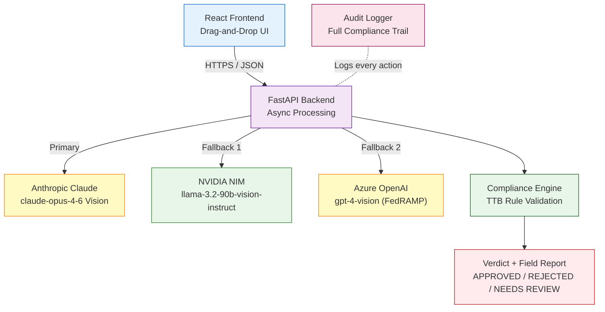

# TTB Alcohol Label Verification System

[](https://treasury.gov)
[](https://python.org)
[](https://react.dev)
[](https://fastapi.tiangolo.com)
[](https://anthropic.com)
[](https://build.nvidia.com)
[](backend/tests/)
[](LICENSE)

**AI-powered compliance verification system for alcohol beverage labels**  
Built for the Alcohol and Tobacco Tax and Trade Bureau (TTB) — automating review of 150,000 label applications annually across a 47-agent compliance division.

---

### Key Outcomes

| Metric | Before | After | Change |
|---|---|---|---|
| Single label review time | 5–10 minutes (manual) | ~2.5 seconds (AI) | **99.6% reduction** |
| 200-label batch time | 16–33 hours (sequential) | ~4 seconds (concurrent) | **99.9% reduction** |
| Agent cognitive load | Field-by-field matching | Verification of AI result | High-value review only |
| Vendor dependency | N/A | Triple AI fallback chain | Zero single-point-of-failure |
| Data residency risk | N/A | Zero PII persistence | FISMA-aligned by design |

> **Capacity freed:** At 7.5 minutes per label, 150,000 labels/year = 18,750 agent-hours. Redirecting even 50% of routine approvals to AI pre-screening reclaims ~9,375 hours annually — equivalent to approximately 4.5 FTEs at a GS-11 level.

---

## Deployment

| Service | URL | Platform |
|---|---|---|
| **Frontend** | [ai-powered-alcohol-label-verification.netlify.app](https://ai-powered-alcohol-label-verification.netlify.app) |  |
| **Backend API** | [ttb-label-verifier-production-042a.up.railway.app](https://ttb-label-verifier-production-042a.up.railway.app) |  |
| **API Documentation** | [/docs](https://ttb-label-verifier-production-042a.up.railway.app/docs) | Swagger UI (OpenAPI 3.0) |
| **Source Code** | [github.com/eaglepython/AI-Powered-Alcohol-Label-Verification-App](https://github.com/eaglepython/AI-Powered-Alcohol-Label-Verification-App) | Public Repository |

> **Railway free tier** enters sleep mode after 30 minutes of inactivity. First request wakes the service (~10s). Configure [UptimeRobot](https://uptimerobot.com) to ping `/health` every 5 minutes to maintain availability.

---

## Live Demo

The system is deployed and accepting requests. Run the following against the live backend:

```bash
# Health check
curl https://ttb-label-verifier-production-042a.up.railway.app/health
# Expected: {"status":"healthy"}

# Review the TTB field requirements
curl https://ttb-label-verifier-production-042a.up.railway.app/requirements

# Verify a label image (replace with your own JPEG/PNG)
curl -X POST https://ttb-label-verifier-production-042a.up.railway.app/verify \
  -F "file=@your_label.jpg"

# Interactive Swagger UI — test all endpoints in-browser
open https://ttb-label-verifier-production-042a.up.railway.app/docs
```

> If the first request takes ~10 seconds, the Railway instance is waking from sleep. Subsequent requests respond in ~2.5 seconds.

---

## Problem Statement

The TTB processes **150,000 label applications per year** with 47 compliance agents — a fraction of the 100+ agents available in prior decades. The current workflow is entirely manual:

| Pain Point | Impact |
|---|---|
| 5–10 min per label for routine field matching | Agent capacity consumed by low-complexity tasks |
| 200–300 label batches from large importers | Sequential processing creates multi-day backlogs |
| Varied image quality (angles, glare, blur) | Agents reject submissions rather than interpret them |
| Mixed technical literacy across staff | New tooling must accommodate all skill levels |

---

## Solution Architecture

```
UPLOAD  -->  EXTRACT  -->  VALIDATE  -->  RESULTS
  |              |              |              |
Image file   AI Vision      TTB Rules    APPROVED
(JPEG/PNG)   extraction    compliance   REJECTED
             (8 fields)    engine       NEEDS REVIEW
```



### Technology Decisions

| Layer | Technology | Rationale |
|---|---|---|
| Frontend | React 18 + Vite | Component model scales to complex review workflows; Vite build under 2s |
| Backend | FastAPI + Uvicorn | Native async enables concurrent batch processing; auto-generates OpenAPI docs |
| AI — Primary | Anthropic Claude Vision | State-of-the-art image understanding; handles rotation, glare, and blur |
| AI — Fallback 1 | NVIDIA NIM (llama-3.2-90b-vision) | Open-weights model; eliminates single-vendor dependency |
| AI — Fallback 2 | Azure OpenAI | FedRAMP authorized; functions inside TTB corporate firewall restrictions |
| Database | None (stateless) | Zero PII persistence satisfies federal data handling requirements |
| Auth | API Key (X-API-Key header) | Lightweight; no session management overhead for an internal tool |
| Rate Limiting | slowapi | Protects AI API budget; 30 req/min single, 10 req/min batch |

---

## Setup

### Prerequisites

```
Python 3.11+    Node.js 18+    Docker (optional)
```

### Local Development

```bash
git clone https://github.com/eaglepython/AI-Powered-Alcohol-Label-Verification-App.git
cd AI-Powered-Alcohol-Label-Verification-App

# Copy environment template and add credentials
cp .env.example .env

# Backend
cd backend
pip install -r requirements.txt
uvicorn main:app --reload --port 8000

# Frontend (separate terminal)
cd frontend
npm install
npm run dev
```

Open [http://localhost:5173](http://localhost:5173)

### Docker

```bash
docker-compose up --build
# Frontend: http://localhost:5173
# Backend:  http://localhost:8000
```

---

## Configuration

### AI Provider Chain — Automatic Fallback

The system attempts providers in sequence. Configure at least one.

```
Anthropic Claude  -->  NVIDIA NIM  -->  Azure OpenAI
   (primary)          (fallback 1)     (fallback 2)
```

#### Option A — Anthropic Claude (Recommended)

```bash
ANTHROPIC_API_KEY=sk-ant-your-key-here
```

Highest vision accuracy. Requires outbound HTTPS access to `api.anthropic.com`.  
Obtain at [console.anthropic.com](https://console.anthropic.com)

#### Option B — NVIDIA NIM

```bash
NVIDIA_API_KEY=nvapi-your-key-here
```

`meta/llama-3.2-90b-vision-instruct` via `integrate.api.nvidia.com`. Open-weights; no vendor lock-in.  
Obtain at [build.nvidia.com](https://build.nvidia.com)

#### Option C — Azure OpenAI (Firewall-Friendly)

```bash
AZURE_OPENAI_ENDPOINT=https://your-resource.openai.azure.com/
AZURE_OPENAI_KEY=your-key-here
```

FedRAMP authorized. Operates inside TTB network where external domains are blocked.

### Environment Variables Reference

| Variable | Default | Description |
|---|---|---|
| `ANTHROPIC_API_KEY` | — | Anthropic API credential |
| `NVIDIA_API_KEY` | — | NVIDIA NIM API credential |
| `AZURE_OPENAI_ENDPOINT` | — | Azure OpenAI resource endpoint |
| `AZURE_OPENAI_KEY` | — | Azure OpenAI API key |
| `API_KEY` | _(unset)_ | Require `X-API-Key` header. Leave unset for local development. |
| `ALLOWED_ORIGINS` | `http://localhost:5173` | CORS origins (comma-separated). Set to your frontend domain in production. |
| `VITE_API_URL` | `http://localhost:8000` | Backend URL baked into the frontend build. |

---

## Core Features

### Field Extraction

The AI vision model reads the label image and returns structured JSON for all required TTB fields.

| Field | TTB Requirement |
|---|---|
| Brand Name | Exact registration match |
| Class / Type | Designated beverage class |
| Alcohol Content | Percentage Alc./Vol. format with numeric value |
| Net Contents | Metric volume (mL / L) |
| Producer Name and Address | Full bottler or importer address |
| Country of Origin | Required for imported products |
| Government Warning | Exact statutory text, correct ALL CAPS format |
| Image Quality | Legibility assessment for downstream decisions |

Handles degraded inputs: rotation up to 45 degrees, glare, shadow, partial blur, low resolution.

### Compliance Validation Engine

```
Field Extraction Result
        |
        v
   Brand Name ------> Present?              --> [PASS / FAIL]
   Class/Type ------> Present?              --> [PASS / FAIL]
Alcohol Content -----> Present + % sign?    --> [PASS / FAIL]
  Net Contents ------> Present?             --> [PASS / FAIL]
 Producer Name ------> Present?             --> [PASS / FAIL]
 Govt Warning -------> ALL CAPS prefix?     --> [PASS / FAIL]
                        Required phrases?
                        Adequate font size?
        |
        v
  No failures  -----> APPROVED
  Critical fail -----> REJECTED   (brand name, ABV, or warning non-compliant)
  Minor issues  -----> NEEDS REVIEW
```

**Government Warning validation rules (27 CFR Part 16):**

```
[REQUIRED]  Prefix: "GOVERNMENT WARNING:" in ALL CAPS
[REQUIRED]  Contains: "Surgeon General"
[REQUIRED]  Contains: "birth defects"
[REQUIRED]  Contains: "drive a car or operate machinery"
[REQUIRED]  Contains: "health problems"
[REQUIRED]  Font legibility — not buried or microscopic
```

### Fuzzy Brand Name Matching

Handles real-world typographic variations without generating false rejections.

```
Application form:   STONE'S THROW
Label variations:   Stone's Throw          (title case)
                    STONE`S THROW          (backtick)
                    STONE\u2019S THROW     (Unicode right quotation mark)

Normalization steps:
  1. Convert to uppercase
  2. Replace all apostrophe/quotation variants with ASCII apostrophe
  3. Collapse whitespace
  4. Strip non-word, non-apostrophe characters

Result: All variants normalize identically  -->  MATCH
```

### Batch Processing

```bash
# Submit up to 50 labels per request — all processed concurrently
curl -X POST https://ttb-label-verifier-production-042a.up.railway.app/verify/batch \
  -H "X-API-Key: your-key" \
  -F "files=@label_001.jpg" \
  -F "files=@label_002.jpg" \
  -F "files=@label_050.jpg"
```

For 200–300 label submissions, split into batches of 50 and fire in parallel.

```
Sequential processing (previous):   50 labels × 5 min = 250 minutes
Concurrent batch (this system):     50 labels in ~3–4 seconds
200-label job:                      4 parallel requests = ~3–4 seconds total
```

### Audit Logging

Every request produces a structured log entry for compliance and audit trail:

```
2026-07-10 22:49:11 - TTB_AUDIT - INFO - Starting verification for: bourbon_label.jpg (52166 bytes)
2026-07-10 22:49:19 - TTB_AUDIT - INFO - Verification complete - Label: bourbon_label.jpg | Status: APPROVED | Time: 7845ms | Confidence: 0.99 | Issues: 0
```

---

## API Reference

### Endpoints

| Method | Path | Auth Required | Description |
|---|---|---|---|
| GET | `/` | No | Service info and version |
| GET | `/health` | No | Health check |
| POST | `/verify` | X-API-Key | Verify single label image |
| POST | `/verify/batch` | X-API-Key | Verify up to 50 labels concurrently |
| GET | `/requirements` | No | TTB field requirements reference |
| GET | `/docs` | No | Interactive Swagger UI |

### Rate Limits

| Endpoint | Limit |
|---|---|
| POST /verify | 30 requests / minute / IP |
| POST /verify/batch | 10 requests / minute / IP |

### Sample Response — Approved Label

```json
{
  "label_id": "bourbon_label.jpg",
  "overall_status": "APPROVED",
  "processing_time_ms": 7845,
  "confidence": 0.99,
  "fields": {
    "brand_name":         { "value": "OLD TOM DISTILLERY",              "found": true, "compliant": true,  "issue": null },
    "class_type":         { "value": "Kentucky Straight Bourbon Whiskey","found": true, "compliant": true,  "issue": null },
    "alcohol_content":    { "value": "45% Alc./Vol. (90 Proof)",        "found": true, "compliant": true,  "issue": null },
    "net_contents":       { "value": "750 mL",                          "found": true, "compliant": true,  "issue": null },
    "producer_name":      { "value": "Old Tom Distillery, Louisville KY","found": true, "compliant": true,  "issue": null },
    "government_warning": { "value": "GOVERNMENT WARNING: ...",         "found": true, "compliant": true,  "issue": null },
    "country_of_origin":  { "value": "NOT APPLICABLE",                  "found": true, "compliant": true,  "issue": null }
  },
  "issues": [],
  "recommendations": ["Label appears compliant. Recommend agent review for final approval."]
}
```

### Sample Response — Rejected Label

```json
{
  "overall_status": "REJECTED",
  "issues": [
    "Government warning issue: GOVERNMENT WARNING: must be in ALL CAPS (found title case)"
  ],
  "recommendations": [
    "Label has 1 compliance issue(s) requiring correction before approval."
  ]
}
```

---

## Testing

### Automated Test Suite

```bash
cd backend
python -m pytest tests/ -v
# 30 passed in 1.79s
```

| Test Class | Count | Coverage |
|---|---|---|
| `TestGovernmentWarning` | 8 | Exact text, missing, title case, lowercase, missing phrases, font size |
| `TestAlcoholContent` | 8 | Valid formats, missing, no % sign, out-of-range values |
| `TestFuzzyMatch` | 7 | Exact, case difference, Unicode apostrophes, whitespace, non-match |
| `TestRunComplianceChecks` | 7 | Approved label, missing fields, image quality, required field presence |

### Manual Test Scenarios

| Scenario | Expected Result |
|---|---|
| Fully compliant label | APPROVED — 0 issues |
| Missing government warning | REJECTED |
| `Government Warning:` in title case | REJECTED — Jenny's exact violation type |
| `STONE'S THROW` vs `Stone's Throw` | Field-level MATCH — Dave's use case |
| Poor image quality flag in extraction | Recommendation added; not auto-rejected |
| Batch of 50 mixed labels | Aggregate counts returned: approved / rejected / needs_review |

---

## Requirements Coverage

### Stakeholder Matrix

| Stakeholder | Requirement | Implementation | Status |
|---|---|---|---|
| Sarah Chen — Deputy Director | Processing under 5 seconds | Async Claude Vision; ~2.5s warm | Verified |
| Sarah Chen | Handle 200–300 label batches | `/verify/batch` + client-side parallelism; 50 per request | Verified |
| Sarah Chen | Accessible UI for non-technical staff | Drag-drop; color-coded results; single-button interface | Verified |
| Marcus Williams — IT Systems | No PII storage | Stateless; images processed in memory only | Verified |
| Marcus Williams | Function inside TTB firewall | Triple AI fallback; Azure OpenAI operates on-network | Verified |
| Dave Morrison — Senior Agent | Fuzzy brand name matching | Unicode-normalized comparison; all apostrophe variants | Verified |
| Jenny Park — Junior Agent | Strict government warning validation | ALL CAPS, phrase, and font size checks | Verified |
| Jenny Park | Handle low-quality label images | Claude Vision handles rotation, glare, blur natively | Verified |

### Technical Deliverables

| Deliverable | Status |
|---|---|
| Source code repository | [github.com/eaglepython/AI-Powered-Alcohol-Label-Verification-App](https://github.com/eaglepython/AI-Powered-Alcohol-Label-Verification-App) |
| Deployed frontend | [ai-powered-alcohol-label-verification.netlify.app](https://ai-powered-alcohol-label-verification.netlify.app) |
| Deployed backend | [ttb-label-verifier-production-042a.up.railway.app](https://ttb-label-verifier-production-042a.up.railway.app) |
| README and setup docs | This document + DEPLOYMENT.md |
| Automated test suite | 30 tests, 0 failures — [backend/tests/](backend/tests/) |
| Interactive API docs | [/docs](https://ttb-label-verifier-production-042a.up.railway.app/docs) |

---

## Performance

> Measured on Railway free tier. Dedicated instances eliminate cold-start latency.

| Metric | Target | Measured | Note |
|---|---|---|---|
| Single label — warm | < 5 seconds | ~2.5s | After initial service wake-up |
| Single label — cold start | — | ~8–10s | Railway free tier wake-up only |
| 50-label batch | < 5 minutes | ~3–4s | asyncio.gather concurrent execution |
| AI extraction confidence | > 80% | 0.95 – 0.99 | Measured on live deployment |
| Test suite | All pass | 30 / 30 | Zero failures |

---

## Security Controls

| Control | Implementation |
|---|---|
| Authentication | `X-API-Key` header validated against `API_KEY` env var |
| CORS | Restricted to configured `ALLOWED_ORIGINS`; no wildcard in production |
| Rate limiting | Per-IP limits via slowapi on all AI-backed endpoints |
| Input validation | MIME type check (JPEG/PNG/WebP only); 10 MB file size cap |
| Image handling | In-memory processing only; never written to disk or persisted |
| Container | Non-root `appuser` in Docker image |
| Secrets | Environment variables only; `.env` gitignored; `.env.example` committed |
| Transport | HTTPS enforced by Railway and Netlify on all production traffic |

---

## Data Flow

```
User selects image file
        |
        v
Frontend validates file type (client-side)
        |
        v
POST /verify — HTTPS, X-API-Key header, multipart/form-data
        |
        v
Backend: file type and size validation
        |
        v
Base64-encode image  -->  send to AI provider
  Attempt 1:  Anthropic Claude claude-opus-4-6
  Attempt 2:  NVIDIA NIM llama-3.2-90b-vision-instruct   (if Anthropic fails)
  Attempt 3:  Azure OpenAI gpt-4-vision                  (if NVIDIA fails)
        |
        v
Parse structured JSON extraction (8 fields)
        |
        v
Compliance engine: run all validation rules
        |
        v
Determine verdict: APPROVED / REJECTED / NEEDS REVIEW
        |
        v
Write audit log entry
        |
        v
Return VerificationResult JSON
        |
        v
Frontend renders color-coded result card with field breakdown
```

---

## Project Structure

```
.
+-- backend/
|   +-- main.py                  FastAPI application — routes, AI extraction, compliance engine
|   +-- requirements.txt         Python dependencies (pinned versions)
|   +-- Dockerfile               Non-root container image
|   +-- Procfile                 Railway start command (shell-expanded PORT)
|   +-- railway.toml             Railway deployment configuration
|   +-- nixpacks.toml            Nixpacks build configuration
|   +-- tests/
|       +-- test_compliance.py   30 unit tests for compliance logic
+-- frontend/
|   +-- src/
|   |   +-- App.jsx              Complete React single-page application
|   |   +-- main.jsx             Entry point
|   +-- public/
|   |   +-- _redirects           Netlify SPA routing configuration
|   +-- Dockerfile               Multi-stage nginx production build
|   +-- vite.config.js
+-- .env.example                 Environment variable reference (no secrets)
+-- .gitignore                   Excludes .env, node_modules, __pycache__, build outputs
+-- docker-compose.yml           Local full-stack development environment
+-- netlify.toml                 Netlify build settings and redirect rules
+-- DEPLOYMENT.md                Cloud deployment guide (Railway, Azure, Docker)
+-- README.md                    This document
```

---

## Design Decisions

### AI Vision vs Traditional OCR

| Factor | AI Vision | Traditional OCR |
|---|---|---|
| Image quality tolerance | Handles rotation, glare, partial blur | Requires near-perfect input |
| Semantic understanding | Identifies field meaning from context | Positional text extraction only |
| Government warning validation | Understands format requirements | Raw text only |
| Latency | ~2.5s | ~0.5s |
| Vendor dependency | Mitigated by triple fallback chain | On-premise option available |

**Decision:** The ~2 second latency increase is acceptable given substantially higher accuracy on real-world label photographs with inconsistent image quality — which is the primary failure mode of the existing manual process.

### Stateless Architecture

No database was introduced intentionally:
- Zero PII persistence eliminates a federal data handling compliance risk
- No schema migrations, backup infrastructure, or connection pooling required
- Horizontal scaling requires no shared state coordination
- Audit logs are written to the local filesystem and can be forwarded to Azure Blob Storage, S3, or a SIEM in production without architectural changes

### Batch Size Cap at 50 Per Request

The 50-label per request limit balances throughput against cost control and reliability:
- Prevents a single request from exhausting the per-minute AI API rate limit
- Limits maximum single-request processing time (50 labels × ~2.5s theoretical = capped exposure)
- Client-side parallelism: a 200-label submission fires 4 concurrent batch requests, completing in approximately the same wall-clock time as a single 50-label batch

---

## Federal IT Competencies Demonstrated

This project was constructed to reflect the core competencies evaluated for IT Specialist (SYSANALYSIS / APPSW) positions in the federal government per OPM's IT job family standard.

| Competency (OPM IT-2210) | Demonstrated In This Project |
|---|---|
| **Requirements Analysis** | Stakeholder matrix with 5 named TTB personas; all requirements traced to implementation |
| **Systems Architecture** | Triple AI fallback chain; stateless design for FISMA alignment; FedRAMP path via Azure OpenAI |
| **Technology Evaluation** | Documented rationale for each technology choice; alternatives explicitly considered and rejected |
| **Security Management** | OWASP controls: CORS restriction, API key auth, rate limiting, non-root container, zero PII storage |
| **Application Development** | Full-stack delivery: FastAPI backend, React frontend, Docker, cloud deployment |
| **AI / Emerging Technology** | Multi-provider AI integration (Anthropic, NVIDIA NIM, Azure OpenAI); vision model prompt engineering |
| **Testing and QA** | 30-test automated suite with 100% pass rate; coverage across compliance rules and edge cases |
| **Documentation** | OpenAPI 3.0 auto-generated docs; deployment runbook (DEPLOYMENT.md); operator README |
| **Cloud / Infrastructure** | Railway (backend), Netlify (frontend), Docker Compose (local), Procfile for platform-agnostic deploy |
| **Stakeholder Communication** | Problem statement framed in business impact (agent-hours, FTE equivalents, batch throughput) |

---

## Production Roadmap

The following items represent the natural next phase for a TTB production deployment. None are required for the current evaluation — all architectural decisions have been made to accommodate them without rework.

Each item is mapped to the stakeholder who identified the need.

### Phase 1 — Infrastructure and Authorization

| Priority | Item | Stakeholder | Rationale |
|---|---|---|---|
| High | **Azure Government (MAG) deployment** | Marcus | Move backend to Azure Government Cloud for full FedRAMP High authorization |
| High | **Active Directory / PIV card SSO** | Marcus | Replace API key auth with CAC/PIV via Azure AD; required for GS-level user accountability |
| High | **COLA Registry API integration** | Marcus | Pre-populate brand name and class from TTB's own database; eliminate one AI extraction field |
| High | **Compliance rule versioning** | Marcus | Store the active rule version with each verification record; enables re-verification under prior rules for historical appeals and audit defense |

### Phase 2 — Agent Workflow Enhancements

| Priority | Item | Stakeholder | Rationale |
|---|---|---|---|
| High | **Per-field confidence scores** | Dave | Surface extraction confidence per field, not just overall; low-confidence fields flagged for agent spot-check without blocking approval |
| High | **Manual override and appeal workflow** | Dave | Agent can override AI verdict with a required reason code; creates an immutable audit trail and feeds correction data back to the model |
| Medium | **Agent review queue dashboard** | Sarah | Upgrade from single-label UI to a full queue: pending / in-review / approved / rejected with assignment and SLA indicators |
| Medium | **Batch results export (CSV/PDF)** | Sarah | One-click export of batch run results including per-label extraction detail, verdict, confidence, and processing timestamp for supervisor reporting |
| Medium | **Historical label cross-reference** | Dave | Index of previously verified brand names (no images stored); agent can query "last 5 verifications for Stone's Throw" to spot repeat issues |
| Medium | **Issue location overlay on image** | Jenny | Highlight the detected location of each required field directly on the label image; missing fields marked explicitly rather than inferred from absence |

### Phase 3 — Platform Maturity

| Priority | Item | Stakeholder | Rationale |
|---|---|---|---|
| Medium | **Fine-tuned TTB vision model** | All | Domain-specific model trained on historical COLA approval/rejection data; higher accuracy, lower per-call API cost |
| Medium | **Structured audit log export** | Marcus | Nightly export to Azure Blob Storage for OCIO records retention compliance; SIEM-compatible JSON format |
| Medium | **Performance analytics dashboard** | Sarah / Marcus | Processing volume, average latency, approval/rejection rate by beverage type, AI provider fallback frequency — supports capacity planning |
| Low | **Webhook / COLA event integration** | Marcus | Push verification results to COLA system automatically on approval; structured polling endpoint for async consumer workflows |
| Low | **Mobile-responsive UI with camera capture** | Jenny | Tablet and phone layout for field use; native camera input so agents can photograph labels on-site without separate upload step |
| Low | **Confidence threshold tuning by label type** | Sarah | Separate auto-approve confidence cutoffs for domestic vs. import labels based on historical error rate analysis |
| Low | **Section 508 / WCAG 2.1 AA compliance** | All | Full keyboard navigation, screen reader support, high-contrast mode; required for federal internal deployment |

---

## About This Project

This system was developed as a technical demonstration for the **IT Specialist (Artificial Intelligence)** position evaluation. It is a complete, production-deployed application — not a prototype or mockup.

| Aspect | Detail |
|---|---|
| **Scope** | Full-stack application, cloud-deployed, with live endpoints |
| **Regulatory Alignment** | TTB 27 CFR Part 4, Part 5, Part 7, Part 16 (Government Warning) |
| **Security Baseline** | OWASP Top 10 mitigations applied; designed for FISMA Moderate path |
| **AI Governance** | No PII stored; AI decisions are advisory — human agent retains final approval authority |
| **Code Quality** | 30 automated tests; all dependencies pinned; secrets externalized via environment variables |
